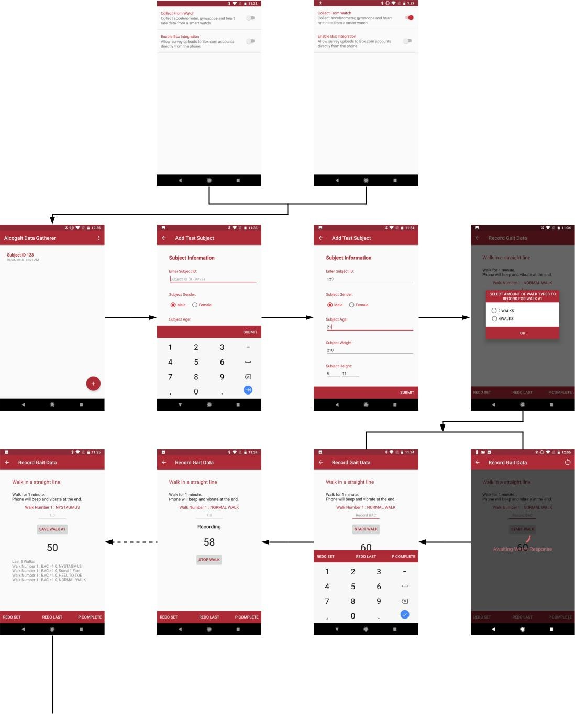
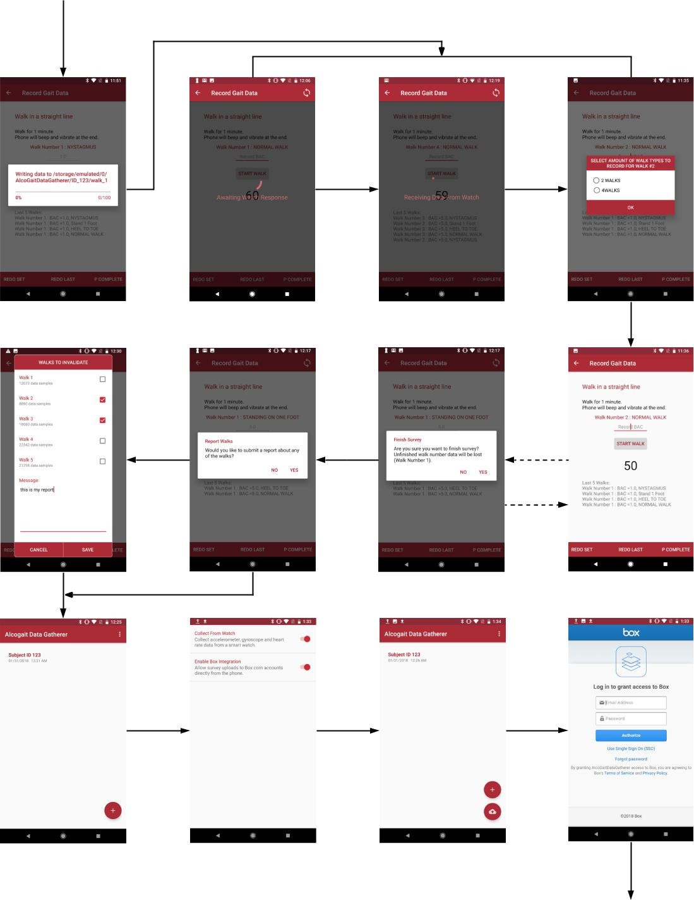
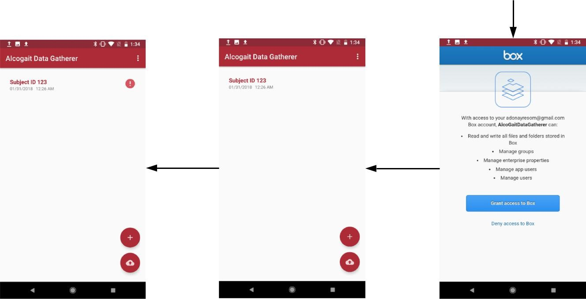
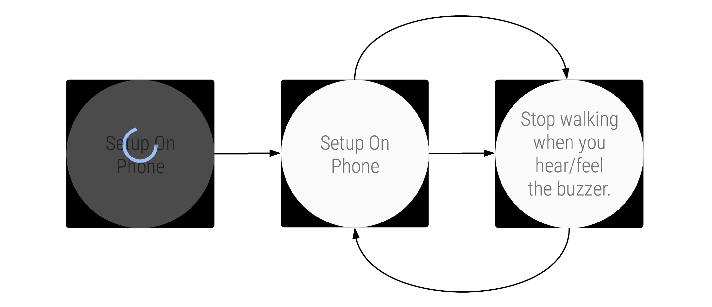

# AlcoGaitDataGatherer Software Documentation

**WPI Research Project**

**Author: Adonay Resom**

**January 17, 2017**

AlcoGaitDataGatherer is an android application that is used to collect gait data (walking behavior) from 250 alcohol drinking test subjects via sensors in smartphones and wearable Android devices (specifically smartwatches). Subjects will be drinking alcohol throughout the experiment while the application records data at various BAC ranges.

# 1. **Compiling**

The application was developed using Android Studio 3.0. In addition to the Android Software Development Kit, several other libraries were used through Gradle dependencies (located in the app level build.gradle files).

The Android codebase compiles successfully with Gradle v3.0.0. This application is developed for devices that run the Android API level 26 (Oreo, v8.0.0), however it is also backward compatible with other API levels that are as low as level 23 (Marshmallow, v6.0). A signed APK was used for all tests since the Wearable API does not currently support Phone-Wearable data transfer features while using unsigned APKs.

# 2. **Code**

The Java language was used for developing Android code and it was structured into the following modules and packages:

## 2.1. **app (phone module)**

### 2.1.1. **Interfaces package**

- Contains the interface _BoxUploadProgressListener.java_, which was used to update progress to a custom view while uploading a CSV file from the phone to an online Box account.

### 2.1.2. **Models package**

- Contains Java classes that possess the data types, structures and methods used to collect and store data during tests/surveys from test subjects.
- _Gender.java_ contains predefined constants and methods that are used to create the enumeration (enum) data type called Gender.
- _SensorRecorder.java_ is a class that handles tasks related to recording, storing, and organizing sensor data collected from the smartphone and wearable devices. It extends the ChannelClient class in order to receive CSV files from the wearable.
- _TestSubject.java_ is a class that defines the attributes needed to create objects that represent a single test subject.
- _Walk.java_ is a class that defines the attributes needed to create objects that organize and store sensor data from a single walk. This class is only used for sensor data collected from the phone&#39;s sensors (not wearable devices – see _LiteWalk_.java for wearables).
- _WalkHolder.java_ is a class that defines the attributes needed to create objects that can store several walks (Walk class objects) that share the same walk number but have different WalkType (enum) types. The data is stored in HashMap structure that uses WalkType as a key and a Walk object as a value.

- This implementation was created because it helped decrease the amount of RAM used while recording several walk numbers from a test subject. Initially a single LinkedList variable was used to store all the Walks collected during an entire session. However, that implementation filled the phone&#39;s RAM because there were too many Walk objects being stored into the LinkedList variable. For example, if a session consisted of 30 walk numbers, a maximum total of 30 \* 4 = 120 Walk objects could be created (because a single walk number can contain up to 4 different walk types).
- However, using the WalkHolder implementation, we would store Walk objects that share the same walk number into a WalkHolder object, then once the user is done collecting data for the current walk number and moves on, the data from the WalkHolder object is saved into a CSV file, and all the previous data inside the WalkHolder object is wiped in order to store data from the next walk number.

### 2.1.3. **Tasks package**

- Contains Java classes that extend the _AsyncTask_ class. They handle tasks that require to be processed in separate/individual threads while also accessing the UI thread in order update elements that inform the user about the task&#39;s progress.

- _SaveWalkHolderoCSVTask.java_ is a class that extends the _AsyncTask_ class in order to create a new thread and save the contents of a WalkHolder object into a CSV file located in the phone&#39;s internal storage. While writing the data, it updates a progress bar in the UI thread.
- _UploadToBoxTask.java_ is a class that extends the _AsyncTask_ class in order to upload a CSV file to an online Box account while also updating a custom view inside the application&#39;s home activity with the progress of the uploading process.

### 2.1.4. **UI package**

#### 2.1.4.1. **Activities package**

- _SplashScreenActivity.java_ is a class that generates and controls the splash screen that shows up each time the application is started.
- _HomeActivity.java_ is a class that generates and controls the UI elements contained in the applications home screen. This class mainly generates the list of tests/surveys that have been previously completed. It also displays the upload progress of each file if the upload/synchronize button is pressed. The synchronize button is only available in this activity if the user enables the &#39;Enable Box Integration&#39; option in settings (_SettingsActivity_). It also provides access towards the _SettingsActivity_ and _SurveyFormActivity._
- _SurveyFormActivity.java_ is a class that generates and controls the form in which the user enters the test subject&#39;s subject ID and demographic information. The class restricts the user form entering invalid data before proceeding onto the next screen. The data limitations are displayed on the screen. This activity provides access towards the _DataGatheringActivity_.
- _DataGatheringActivity.java_ is a class that generates and controls the activity in which the user enters BAC data and records gait data. The class also implements other classes from the WearableAPI in order to communicate with wearable devices. The activity enables the user to start and stop a walk at will. It also enables the user to re-do previous walks before saving them. The activity displays different flows based on the user&#39;s preference to use a wearable device. If the user prefers to use a wearable device while recording gait data, additional UI elements are added on to the screen in order to act synchronously with the application in the wearable device. This activity is also in charge of adding and removing listeners that enable the application to read data from sensors and communicate with wearable devices. It also provides access towards the _WalkReportFragment_ and _HomeActivity._
- _SettingsActivity.java_ is a class that generates an activity that displays two options. One option enables the application to collect data from wearable devices, while the other one enables it to upload CSV files to an online Box account.

#### 2.1.4.2. **Fragments package**

- Contains a class called _WalkReportFragment.java._ The fragment generates a panel in front of _DataGatheringActivity_. In this panel a list of check boxes and a text box are generated. The user can use these elements to submit a report along with the collected data. The check boxes in specific can be used to invalidate walks that might have not collected accurate data. Whoever receives the collected data can then read the report and understand the walks that have been negatively affected by events.

#### 2.1.4.3. **Adapters package**

- _MyWalkReportRecyclerView.java_ is a class that is used for generating and getting content from the _RecyclerView_ used in _WalkReportFragment_. The _RecyclerView_ contains information and a check box for each walk and a single text box for writing a report message. As a result, the adapter implements the _CompoundButton.OnCheckedChangeListener_ interface in order to keep track the check boxes that have been selected by the user. When the submit button inside the fragment is pressed, this adapter class receives the user&#39;s input and sends it to the _DataGatheringActivity_ in order to save it along with the gait data collected throughout the survey.
- _SurveyListAdapter.java_ is a class that is used to generate the content displayed on the _HomeActivity_&#39;s _ListView_ element. It basically scans the internal storage of the phone and finds previously completed surveys in order to display them in the _HomeActivty_ in a chronological order.

#### 2.1.4.4. **Views package**

- Contains a class called _CustomSurveyView.java._ The class extends th_e RelativeLayout_ and implements the _BoxUploadProgressListener_ interface. The class is used as the main UI element inside each the _ListView_ item that is displayed in the application&#39;s _HomeActivity._ The class was created because it was difficult to update each _ListView_ element with an upload progresses of the file displayed using normal Android _View_ classes. That is why the class implements the _BoxUploadProgressListener_ interface. The interface makes it easier to update UI elements contained in the class (view) from outside of the class (for example from the _UploadToBoxTask_ class).

## 2.2. **common (shared module)**

- _CommonCode.java_ is a class that contains constants and methods that are shared between the app (phone) module and the wear module.
- _WalkType.java_ contains predefined constants and methods that are used to create the enumeration (enum) data type called WalkType. It contains 4 items. Each item represents a type of walk that the test subject will do during the survey.

## 2.3. **wear (wearable module)**

### 2.3.1. **Models package**

- _LiteWalk.java_ is a class that serves like the _Walk_ class in the **app** module. The only difference between the two is that _LiteWalk_ doesn&#39;t keep track of walk numbers and it stores heart rate data instead of compass data.

### 2.3.2. **Services package**

- _MobileDataListenerService.java_ is a class that extends _WearableListenerService_. This enables the class to run as a service that has the ability to communicate with other Android devices using the WearableAPI. The class also implements the _MessageClient_ class in order to listen to messages from the phone that instruct it to open the AlcoGaitDataGatherer application in the wearable device.

### 2.3.3. **Tasks package**

- _LiteWalkToCSVTask.java_ is a class that extends the _AsyncTask_ class in order to create a new thread and save the contents of _LiteWalk_ objects into a CSV file located in the wearable&#39;s internal storage.

### 2.3.4. **UI package**

- _WearHomeActivity.java_ is a class that generates and controls the one and only activity found in the wearable application. It is also in charge of adding and removing listeners that enable the application to read data from sensors and communicate with wearable devices.

- The activity basically acts as a slave to the _DataGatheringActivty_ displayed on the phone. It can only be controlled from actions implemented on the phone. The activity always starts and stops a walk synchronously with the _DataGatheringActivity._
- After collecting all data needed for a specific walk number, it saves the data into the wearable&#39;s storage using the _LiteWalkToCSVTask_. Then, it receives a request from the _DataGatheringActivity_ to send the CSV file using the _ChannelClient_ class from the WearableAPI. Walk numbers are not tracked in the wearable device because the phone controls such tasks. The only purpose of the wearable application is to collect and send batches of data.

# 3. **Interface Flow**

## 3.1. **Phone Interface Flow Chart**

The phone application behaves slightly differently based on the preferences that the user has set in the settings page. The following flowchart show&#39;s how the application&#39;s interface behaves with different settings (_see next page)_:

  

  

 

  

Figure 1.0 Phone Interface Flow Chart

## 3.2. **Wearable Interface Flow Chart**

The watch application starts with a circular progress bar till it successfully connects to the application in the phone. Then the interface changes in between two states while recording and not recording:

  

Figure 1.1 Wearable Interface Flow Chart